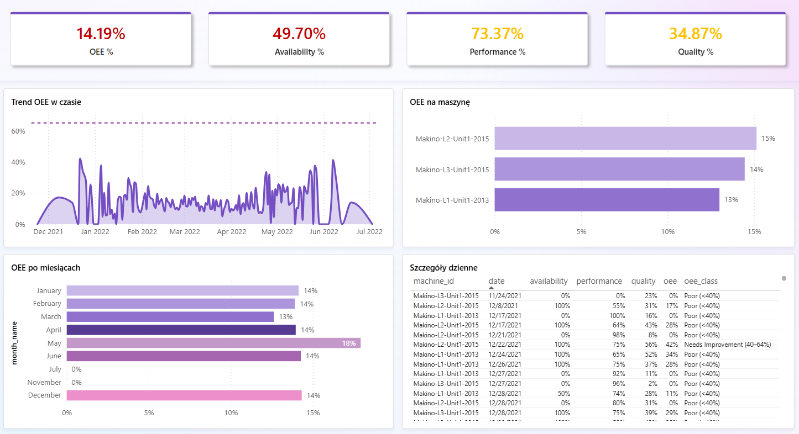
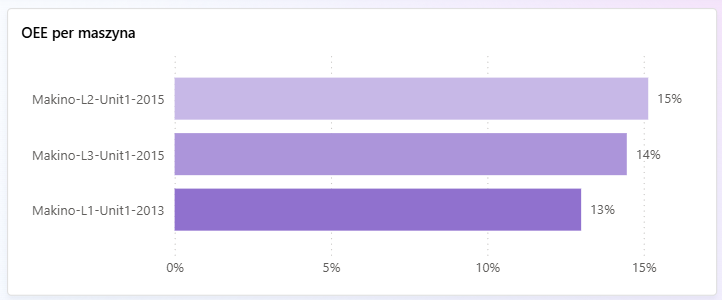
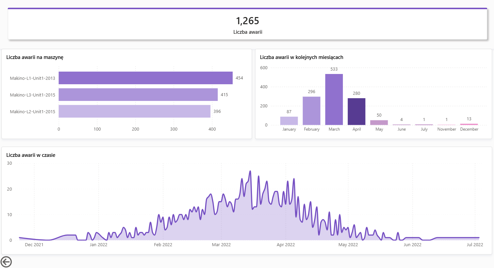
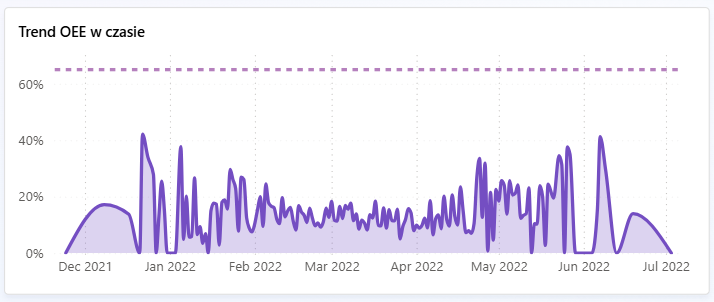

# 📊 Production OEE Dashboard – Power BI

> Interaktywny dashboard monitorowania OEE (Overall Equipment Effectiveness) dla linii produkcyjnych |
> zgodny z metodologią TPM i Lean Manufacturing

## 🎯 O projekcie

Dashboard produkcyjny zbudowany w Power BI, monitorujący kluczowe wskaźniki efektywności maszyn (OEE) dla 3 linii Makino. Dane przygotowane w Pythonie z użyciem pipeline ETL.

OEE = Availability × Performance × Quality

## 📸 Screenshots

### Przegląd OEE – strona główna


### OEE per maszyna


### Analiza awarii


### Trend miesięczny


## 🛠️ Technologie

| Technologia | Zastosowanie |
|---|---|
| Power BI Desktop | Dashboard, wizualizacje, miary DAX |
| Python (pandas, numpy) | ETL – czyszczenie i transformacja danych |
| DAX | Miary KPI: OEE, Availability, Performance, Quality |

## 📊 Dataset

Dane z czujników maszyn produkcyjnych (Kaggle):  
[Optimization of Machine Downtime](https://www.kaggle.com/datasets/srinivasanusuri/optimization-of-machine-downtime)  
2 500 rekordów | 3 maszyny Makino | 16 parametrów czujników

## 🔢 Składniki OEE

| Wskaźnik | Definicja | Źródło danych |
|---|---|---|
| **Availability** | % czasu bez awarii maszyny | Kolumna `Downtime` |
| **Performance** | Prędkość wrzeciona vs. benchmark (p95) | `Spindle_Speed_RPM` |
| **Quality** | Odwrócona skala wibracji narzędzia | `Tool_Vibration` |

## 📈 Miary DAX

```dax
OEE % = ROUND(AVERAGE('oee_cleaned'[oee]) * 100, 1)
Availability % = ROUND(AVERAGE('oee_cleaned'[availability]) * 100, 1)
Performance % = ROUND(AVERAGE('oee_cleaned'[performance]) * 100, 1)
Quality % = ROUND(AVERAGE('oee_cleaned'[quality]) * 100, 1)
Liczba awarii = SUM('oee_cleaned'[failure_count])
```

## 🚀 Uruchomienie

### 1. Przygotuj dane
```bash
pip install pandas numpy openpyxl
python przygotuj_dane.py
```
Skrypt wygeneruje plik `data/oee_cleaned.xlsx`

### 2. Otwórz Dashboard
Otwórz plik `OEE_Dashboard.pbix` w Power BI Desktop  
(bezpłatny download: powerbi.microsoft.com/desktop)

### 3. Odśwież dane
Power BI → Odśwież → wskaż plik `oee_cleaned.xlsx`

## 🏭 Kontekst biznesowy

Dashboard stworzony jako narzędzie monitorowania strategii digitalizacji zakładu produkcyjnego zgodnie z:
- **TPM** (Total Productive Maintenance) – standard OEE w przemyśle
- **World Class Manufacturing** – cel OEE ≥ 85%
- **Industry 4.0** – cyfrowy monitoring maszyn w czasie rzeczywistym

Wyniki analizy: OEE na poziomie ~14% wskazuje zakład wymagający pilnych działań TPM – zidentyfikowano główne obszary poprawy: Availability (awarie) i Quality (wibracje narzędzi).

## 👩‍💻 Autor

**Izabela Popiołek** – Specjalista ds. Digitalizacji | Power BI Developer | AI Analyst  
[LinkedIn](https://linkedin.com/in/izabela-popiolek) | [GitHub](https://github.com/izabela12074)
